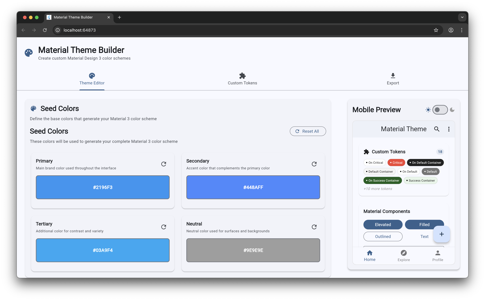

# 🎨 Material Theme Builder

A comprehensive Flutter web application for creating and customizing Material Design 3 color schemes with real-time preview and advanced theming capabilities.

[](https://codecov.io/gh/thanhtunguet/material_theme_builder)



## ✨ Features

### 🎯 **Core Functionality**
- **Material Design 3 Compliant**: Generate themes that follow Google's latest Material Design specifications
- **Four Seed Color System**: Create comprehensive color schemes from Primary, Secondary, Tertiary, and Neutral seed colors
- **Custom Color Tokens**: Define and manage custom color tokens with ThemeExtension support
- **Real-time Preview**: See changes instantly with a comprehensive mobile app preview

### 🎨 **Advanced Theming**
- **Predefined Token Library**: 18+ semantic color tokens (success, warning, error, info, etc.) ready to use
- **Individual Token Editing**: Fine-tune any color token or use auto-generated values
- **Light & Dark Mode Support**: Seamless switching with proper contrast handling
- **Token Categories**: Organized color tokens (Primary, Secondary, Surface, Error, etc.)

### 📱 **Interactive Preview**
- **Mobile App Simulation**: Full mobile interface preview with real components
- **Component Showcase**: Comprehensive Material Design 3 component gallery
- **Multi-tab Interface**: Home, Components, and Forms sections for complete coverage
- **Live Updates**: All changes reflect immediately in the preview

### 📦 **Export Options**
- **Flutter ThemeData**: Complete Dart code ready for your Flutter apps
- **JSON Format**: Structured color data for integration with other tools
- **CSS Custom Properties**: Web-friendly CSS variables
- **Design Tokens**: Standard design token format for design systems
- **ThemeExtension Code**: Generated Dart code for custom color tokens

### 🛠️ **Developer Experience**
- **Responsive Design**: Optimized for desktop development workflows
- **Accessibility Validation**: Built-in contrast checking and WCAG compliance
- **Local Storage**: Automatic saving of your custom themes and tokens
- **Import/Export**: Share and collaborate on theme configurations

## 🚀 Live Demo

**Try it now**: [Material Theme Builder Live Demo](https://thanhtunguet.github.io/material_theme_builder/)

## 🖼️ Screenshots

### Main Interface
The main interface provides a clean, organized workspace for theme creation:


### Key Interface Elements:
1. **Seed Color Panel**: Four primary color inputs for theme generation
2. **Token Editor**: Expandable categories for fine-tuning individual tokens
3. **Custom Tokens Manager**: Create and manage your own semantic color tokens
4. **Live Preview**: Real-time mobile app simulation
5. **Export Panel**: Multiple format options for theme export

## 🛠️ Getting Started

### Prerequisites
- Flutter 3.27.4 or higher
- Dart SDK 3.6.2 or higher
- Web browser with modern JavaScript support

### Installation

1. **Clone the repository**:
   ```bash
   git clone https://github.com/thanhtunguet/material_theme_builder.git
   cd material_theme_builder
   ```

2. **Install dependencies**:
   ```bash
   flutter pub get
   ```

3. **Run the development server**:
   ```bash
   flutter run -d chrome --web-port 8080
   ```

4. **Build for production**:
   ```bash
   flutter build web --release --no-web-resources-cdn
   ```

### Quick Start Guide

1. **Choose Your Seed Colors**: Start with the four seed color inputs (Primary, Secondary, Tertiary, Neutral)
2. **Preview Your Theme**: See the generated theme in the mobile preview panel
3. **Customize Tokens**: Use the Token Editor to fine-tune individual colors
4. **Add Custom Tokens**: Create semantic tokens like "success", "warning", "brand" colors
5. **Export Your Theme**: Choose from multiple export formats (Flutter, JSON, CSS, etc.)

## 🏗️ Architecture

### Project Structure
```
lib/
├── main.dart                    # App entry point
├── models/                      # Data models
│   ├── color_scheme_model.dart  # Material 3 color scheme
│   ├── custom_color_token.dart  # Custom token definition
│   ├── theme_data_model.dart    # Complete theme model
│   └── custom_theme_extension.dart # ThemeExtension implementation
├── services/                    # Business logic
│   ├── theme_generator_service.dart # Material 3 theme generation
│   ├── custom_token_service.dart    # Custom token management
│   ├── export_service.dart          # Multi-format export
│   └── color_utils.dart             # Color manipulation utilities
├── widgets/                     # UI components
│   ├── seed_color_input.dart    # Seed color selection
│   ├── token_editor.dart        # Individual token editing
│   ├── custom_token_editor.dart # Custom token management
│   ├── mobile_preview_panel.dart # Live preview interface
│   └── export_panel.dart        # Export functionality
├── screens/
│   └── theme_builder_screen.dart # Main application screen
└── constants/
    ├── material_tokens.dart     # Material Design 3 token definitions
    └── predefined_tokens.dart   # Semantic color tokens
```

### Key Technologies
- **Flutter Web**: Cross-platform web application framework
- **Material Color Utilities**: Google's official Material Design 3 color algorithms
- **Provider**: State management for reactive UI updates
- **JSON Serialization**: Data persistence and export functionality
- **LocalStorage**: Browser-based theme and token storage

## 📖 Usage Guide

### Creating a Basic Theme

1. **Start with Seed Colors**:
   - Choose a primary color that represents your brand
   - Select complementary secondary and tertiary colors
   - Pick a neutral color for backgrounds and surfaces

2. **Review Generated Colors**:
   - The system generates 24+ color tokens automatically
   - Each token has light and dark mode variants
   - Colors follow Material Design 3 contrast requirements

3. **Customize as Needed**:
   - Expand token categories to see all generated colors
   - Click any color to customize it manually
   - Use the reset button to return to generated values

### Working with Custom Tokens

1. **Add Semantic Colors**:
   ```
   Success Green: #4CAF50
   Warning Orange: #FF9800
   Error Red: #F44336
   Info Blue: #2196F3
   ```

2. **Define Brand Colors**:
   ```
   Brand Primary: #1976D2
   Brand Accent: #FFC107
   Brand Neutral: #9E9E9E
   ```

3. **Export for Flutter**:
   ```dart
   // Generated ThemeExtension
   extension CustomColors on ThemeData {
     CustomColorsExtension get customColors =>
       extension<CustomColorsExtension>()!;
   }
   ```

### Export Formats

#### Flutter ThemeData
Complete theme with custom extensions:
```dart
ThemeData(
  colorScheme: ColorScheme.fromSeed(seedColor: Color(0xFF1976D2)),
  extensions: <ThemeExtension<dynamic>>[
    CustomColorsExtension.light,
  ],
)
```

#### JSON Format
Structured data for integration:
```json
{
  "name": "My Custom Theme",
  "primary": "#1976D2",
  "customTokens": {
    "success": "#4CAF50",
    "warning": "#FF9800"
  }
}
```

## 🤝 Contributing

We welcome contributions! Please see our [Contributing Guidelines](CONTRIBUTING.md) for details.

### Development Setup
1. Fork the repository
2. Create a feature branch: `git checkout -b feature/amazing-feature`
3. Make your changes and test thoroughly
4. Commit with conventional commit messages: `git commit -m 'feat: add amazing feature'`
5. Push to your branch: `git push origin feature/amazing-feature`
6. Open a Pull Request

### Code Quality
- Follow Flutter/Dart style guidelines
- Write tests for new functionality
- Ensure accessibility compliance
- Test on multiple screen sizes

## 🧪 Testing

Run the full test suite:
```bash
# Unit tests
flutter test

# Widget tests
flutter test test/widget_test.dart

# Integration tests
flutter drive --target=test_driver/app.dart
```

## 📦 Building & Deployment

### Local Development
```bash
flutter run -d chrome --web-port 8080
```

### Production Build
```bash
flutter build web --release --web-renderer canvaskit --no-web-resources-cdn
```

### Docker Deployment
```dockerfile
FROM nginx:alpine
COPY build/web /usr/share/nginx/html
EXPOSE 80
CMD ["nginx", "-g", "daemon off;"]
```

## 🌐 Browser Support

| Browser | Version | Status            |
|---------|---------|-------------------|
| Chrome  | 88+     | ✅ Fully Supported |
| Firefox | 85+     | ✅ Fully Supported |
| Safari  | 14+     | ✅ Fully Supported |
| Edge    | 88+     | ✅ Fully Supported |

## 📄 License

This project is licensed under the MIT License - see the [LICENSE](LICENSE) file for details.

## 🙏 Acknowledgments

- **Material Design Team** - For the comprehensive Material Design 3 specifications
- **Flutter Team** - For the amazing web support and theming capabilities  
- **Material Color Utilities** - For the official color generation algorithms
- **Community Contributors** - For feedback, bug reports, and feature suggestions

## 📞 Support

- 🐛 **Bug Reports**: [GitHub Issues](https://github.com/thanhtunguet/material_theme_builder/issues)
- 💡 **Feature Requests**: [GitHub Discussions](https://github.com/thanhtunguet/material_theme_builder/discussions)
- 📖 **Documentation**: [Wiki Pages](https://github.com/thanhtunguet/material_theme_builder/wiki)
- 💬 **Community**: [Discord Server](https://discord.gg/flutter)

## 🔄 Changelog

See [CHANGELOG.md](CHANGELOG.md) for a detailed history of changes and updates.

---

**Made with ❤️ by [thanhtunguet](https://github.com/thanhtunguet)**

*Material Theme Builder - Bringing Material Design 3 theming to your fingertips*